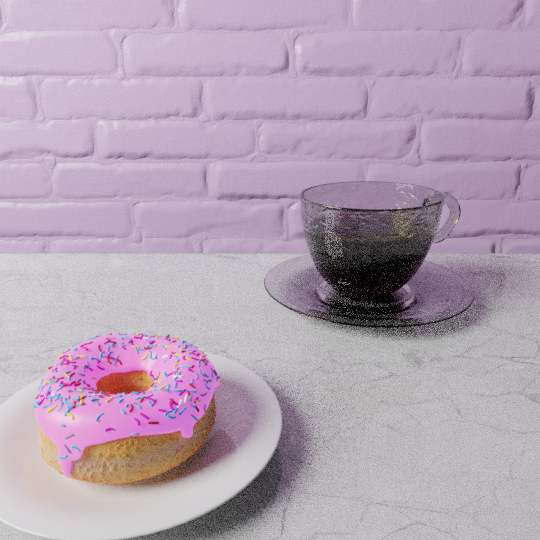
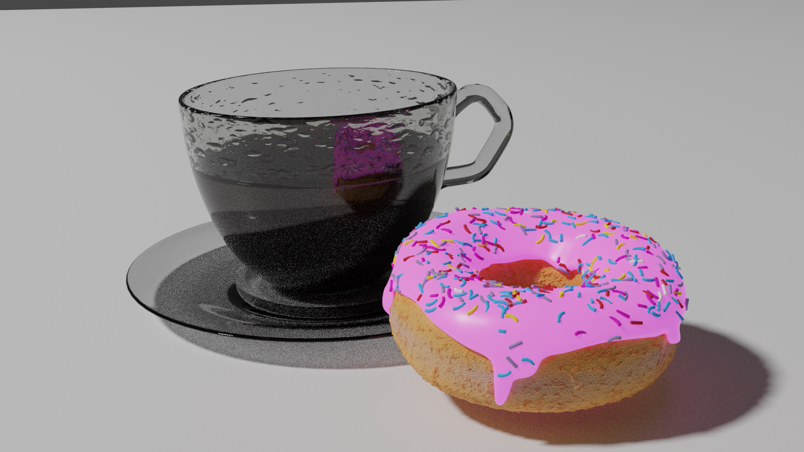
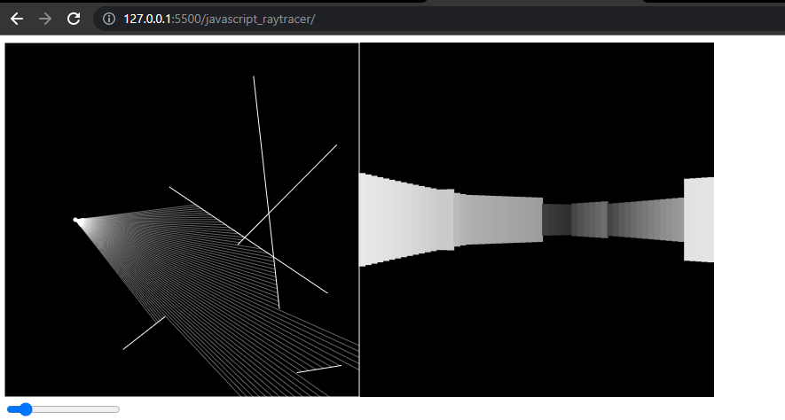
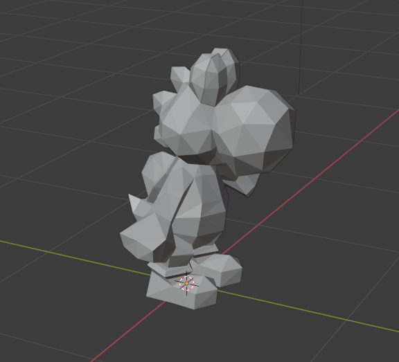
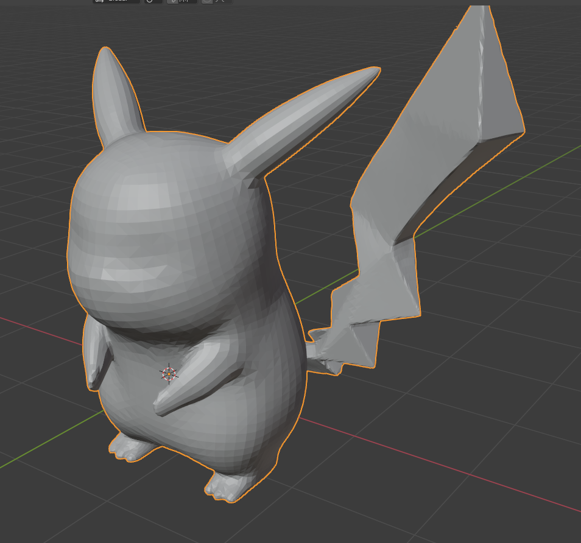

# Computer_Graphics_CSCI8400
Covers the mathematical foundations of three-dimensional representation and animation; ray tracing and path tracing rendering methods

## Developers:
- Andrew Ramirez | [drewRam](https://github.com/drewRam)

## Project Outputs:
### The following are the final products to showcase a collection of the work made 
Always starts off with a [donut](https://www.youtube.com/watch?v=nIoXOplUvAw&ab_channel=BlenderGuru).  
Following this tutorial lead to more personal growth with other Blender Projects. 
Actual Rendered Images of final donut product: 

### JavaScript Raytracer:
Output for the walls are always random so rendering the images always changes for the user. 

### Other Renders
Yoshi: 

 Pikachu: 

